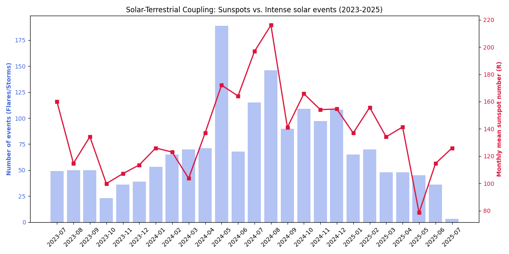

# Solar-Terrestrial-Coupling-Analysis: Sunspots vs Extreme Events

## Description
This project explores the statistical correlation between Solar Photospheric Activity (Sunspots) and Space Weather Events (Flares, CMEs, and Geomagnetic Storms) recorded during the rising phase of Solar Cycle 25.

## Objective
To investigate how the frequency of extreme solar events scales with the emergence of complex magnetic regions (sunspots) using multi-source data integration.

## Scientific Background
The high intensity of magnetic activity in certain regions of the solar photosphere inhibit plasma to undergo convection. These regions are primary sites for the storage of magnetic energy. When these magnetic fields undergo reconnection, they trigger high-energy phenomena such as Solar Flares and Coronal Mass Ejections (CMEs).

Analyzing the "Sunspot Number (R)" alongside event frequency allows us to visualize the Sun's magnetic "pulse" as it approaches the Solar Maximum.

## Methodology
- Load Daily Total Sunspot Number from SILSO/SIDC (Royal Observatory of Belgium). and NASA Space Weather Database (via Kaggle)
- Implementation of a custom Python pipeline to normalize disparate temporal formats (ISO timestamps vs. discrete year/month columns) into a unified monthly-average baseline.
- Visualize the correlation via Dual-axis plotting

## Results
The analysis reveals a high degree of synchronization between both datasets. The results confirm that sunspot numbers serve as a reliable proxy for predicting the frequency of Earth-directed solar events.

## Visualization

## Technologies Used
- Python
- Matplotlib
- CSV data processing
